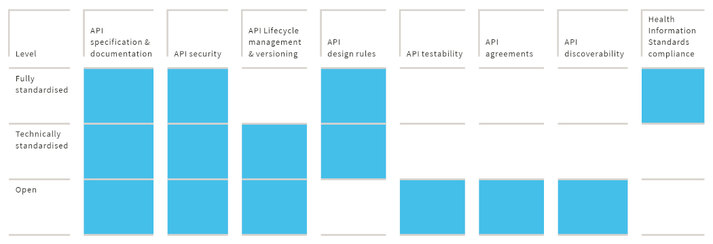

# Definitions and scope

## What is an API?

The term 'API' refers to both a formal specification and a piece of software conforming to that specification. Both
perspectives are used interchangeably, but although an API specification can exist without its actual implementation in
software, the reverse is not possible. On the other hand, a specification without any implementation in actual software
does not (yet) represent real value. A third possible perspective is the deployment perspective. In this case an API can
be viewed as a service that is deployed by some organization to provide specific value for its clients.

No matter the perspective, the purpose of an API is to allow two or more applications to 'talk to each other'. These
applications can be located on the same 'machine', or they can be on different remote machines, connected through some
kind of network using some kind of communication technology.

## Specifications, implementations, and deployments

Due to the different perspectives on what an API is, this specification differentiates between API specifications, API
implementations and API deployments.

### API specification

An API specification is a formal specification of the API. The specification can be used to construct an API
implementation (software) that complies with the specification. It can also be used to develop an API client (more
software) that uses the implementation. The API specification can be viewed as a contract between the API implementation
and an API client.

### API implementation

An API implementation is the software code that implements the specification. It is (part of) a specific software
product created by a specific software developer (organization).

### API deployment

An API deployment is an instance of the software; the actual service deployed by some organization to provide value
for its clients. A specific deployment has a specific endpoint address (a URL in most modern APIs) that API clients use
to access the API implementation.

## Who uses an API?

API specifications are used by a 'competent developer' to create an API implementation or an API client. A competent
developer is a software developer that has experience using the technologies and (healthcare-specific) standards the API
exploits and has basic knowledge of the healthcare domain in general and the specific value the API provides.

API implementations are used by API clients. Both are pieces of software that need to 'talk to each other'.

API deployments are used by API client deployments and form a 'service provider'/'service consumer' pair.

## What are API requirements?

API requirements are requirements for specifying (API specifications), implementing (API implementations), deploying
(API deployments) and using (API clients) an API. In this specification the following conventions are applied when
formulating requirements:

- An API requirement **SHOULD** not overlap with existing rules and regulations. Compliance with rules and regulations
  is assumed.
- Even more important, it **MUST NOT** contradict existing rules and regulations.
- It **SHOULD** be reasonably possible to apply to API requirements. A requirement should not require the impossible.

Many requirements have sub-requirements that conform to the same conventions.

Whenever possible, requirements in this specification are based on or refer to (inter)national requirements and
policies, such as the Dutch National API strategy and national API design rules, international standards and RFCs and
policies like the
[NHS Open API Architecture Policy](https://www.england.nhs.uk/wp-content/uploads/2018/09/open-api-policy.pdf).

## Relationship with (Dutch) Health Information Standards

According to the Dutch competence centre for electronic exchange of health and care information (Nictiz), a Health
Information Standard is a cohesive specification of:

- A use case or a combination of use cases and interaction patterns
- Dataset(s) used within these interactions
- Information models such as HCIMs (Dutch 'Zorg Informatie Bouwstenen' or ZIBs)
- Terminologies
- Communication standards such as [HL7 CDA](http://www.hl7.org/implement/standards/product_brief.cfm?product_id=7) and
  [HL7 FHIR](https://hl7.org/fhir/) (profiles)

As such, a Health Information Standard does not include technical details that are necessary ingredients of an API
specification, such as:

- API signature and semantics
- Identification and authentication of entities
- Security and transport mechanisms such as addressing
- Other required technical parts of an API specification and API documentation as described in
[The contents of an API specification](#the-contents-of-an-api-specification) and
[The contents of API documentation](#the-contents-of-api-documentation)

However, many APIs implement (parts of) Health Information Standards. An API is said to 'implement a Health Information
Standard' when its specification, implementation and deployment comply with the requirements of that Health Information
Standard.

## Relationship with the Dutch API library for healthcare

The Dutch API library for healthcare contains API specifications, implementations and deployments that meet the
requirements in this specification at a particular level of standardization (see
[API levels of standardization](#api-levels-of-standardization)). The API library promotes the findability of APIs that
meet the requirements in this specification.

## API lifecycle

The API lifecycle consists of four phases:

- **Create**: developing the API specification and implementation
- **Deploy**: Deploying the API so it can be used by API clients
- **Deprecate**: Mark the API specification, implementation, or deployment as being removed at a future date
- **Retire**: remove the API specification, implementation and/or deployment

When developing (Create) an API, especially an API specification targeted at the highest level of standardization (see
[API levels of standardization](#api-levels-of-standardization)), it is important to include the viewpoints and insights
of all stakeholders. API development is therefore often considered to be a community effort.

It is important to mitigate the effects of API changes on API clients. Mitigation includes clear communication when
deprecating and retiring an API, but also includes preventing client applications from breaking due to changes to a
deployed API.

This specification includes requirements for all phases of the API lifecycle and includes requirements for lifecycle
management and API versioning.

### API versioning

Updating an API's version is an important measure to help API clients adapt to API changes. Most APIs use the
[Semantic Versioning](https://semver.org/) (SemVer) scheme and update the API's major version when introducing breaking
changes. Non-breaking changes to the API are often reflected by an update in the API's minor version or patch version.

### Breaking changes

A breaking change to an API is any change that can break a client application. Usually, breaking changes involve
modifying or deleting existing parts of an API or adding new required parts. A breaking change can take place in an API
specification, API implementation and in an API deployment.

Examples of breaking changes are:

- Deleting a resource or operation
- Removing an allowed parameter, request field or response field
- Modifying a resource or method URI
- Modifying a field name
- Adding required query parameters without default values
- Introducing a new validation
- Modifying authorization
- Modifying rate-limiting
- Removing TLS (Transport Layer Security) versions or supported encryption methods
- Modifying data formats, encodings, or compression formats

If the intended functionality of an API (method) changes, this might also break the client application and therefore it
is considered a breaking change. For example, if a DELETE request previously used to archive a resource but now hard
deletes the resource, the change potentially breaks client functionality that is supposed to archive a resource.

Breaking changes should be avoided whenever possible.

### Non-breaking changes

Non-breaking changes are changes that cannot be expected to break a client application. Adding optional parts to an API
is never considered a breaking change. Examples of non-breaking changes are:

- Addition of new endpoints
- Addition of new resources or operations to existing endpoints
- Addition of new fields in the following scenarios:
    - New fields in responses
    - New optional request fields or parameters
    - New required request fields that have default values
- Addition of optional query parameters
- Changes to the order of fields returned within a response
- Addition of an optional request header
- Removal of redundant request header
- Changes to the overall response size
- Changes to error messages

Requirement LM007 states that API clients MUST be designed to handle non-breaking changes.

## Using a Software Development Kit (SDK) for easy access to APIs

While APIs can be consumed using any platform or programming language, Software Development Kits make it easier to
access APIs from a particular platform and/or language of choice. An SDK is usually made up of one or more software
libraries, tools, and documentation. For example, Microsoft provides SDKs for accessing Azure APIs from several
different platforms, including iOS, Android, JavaScript, and .NET. Another example is the Facebook SDK for integrating
Facebook features in games built on the Unity platform.

This specification does not require the provision or use of an SDK to access an API. Nevertheless, this specification
does include requirements in case an SDK is provided.

## API protocols and API styles

This document specifies requirements for APIs that are built on top of the HTTP protocol. HTTP, or Hyper Text Transfer
Protocol, is the protocol that fuels the World Wide Web. It is a high-level protocol that provides mechanisms for
communication between clients and servers with requests and responses. The best-known HTTP client is a web browser that
is used to communicate with web servers, requesting data and web pages from web servers or sending user input to web
servers.

The reason for restricting this specification to HTTP-based APIs is threefold:

1. The world has been transitioning to the use of HTTP-based APIs ever since the web 2.0 era at the beginning of the
  21st century. Therefore most modern API technologies that are based on the HTTP protocol and legacy technologies, such
  as CORBA and DCOM, are slowly but surely disappearing from the global arena.
2. As a result of this, many (if not most) standards for secure communication are based on or are working in accordance
  with the HTTP protocol. Examples are the numerous RFCs for authorization (like OAuth 2.0) and authentication (like 
  OpenID Connect), as well as stacks of security protocols such as WS-Security. Other examples include HTTP-header based
  content negotiation schemes and protocols for distributed identity management such as the Verifiable Credentials HTTP
  API.
3. Modern development tools (as well as developer training materials) are optimized for building applications that
  leverage the HTPP protocol and the various design patterns and protocols that work with HTTP or are built on top of
  HTTP.

APIs that use the HTTP protocol are often referred to as WEB APIs. WEB APIs are used to communicate between applications
over the internet but can also be used for communication over private networks or even between applications on the same
machine. WEB APIs are often divided into two groups: SOAP-based APIs and RESTful APIs. SOAP is a protocol on top of HTTP
(amongst others) while REST is an architectural style that leverages plain HTTP commands (verbs) for communication
between the API client and the API server. SOAP is often associated with the WEB 1.0 era while today's modern WEB APIs
are edging towards the REST architectural style. Nevertheless, both SOAP-based APIs and RESTful APIs coexist and many
existing and successful initiatives for health information exchange are based on SOAP APIs. Newer WEB API technologies
and styles, like GraphQL and gRPC, are rising constantly.

This specification strives to provide requirements that apply to all flavours of WEB APIs. However, its focus will be on
REST APIs simply because of its growing popularity in Health IT. For example, the popular HL7 FHIR API specification is
based on the REST architectural style.

## A layered typology of APIs

It is common to differentiate between three categories of APIs: system APIs, process APIs and convenience or experience
APIs. The [Dutch API strategy](https://docs.geostandaarden.nl/api/API-Strategie/) uses this differentiation which was
originally proposed by [MuleSoft](https://www.mulesoft.com/resources/api/types-of-apis). This differentiation is based
on design principles like 'separation of concerns' and the need for reusability of specifications and software
components such as APIs.

### System APIs

System APIs are atomic APIs. They expose 'raw' access to data and functionality from a system of record. They cannot be
divided into smaller parts without losing usefulness and meaningfulness: you cannot create a meaningful API that exposes
the first half of a medical diagnosis or one that creates an outpatient appointment for a particular date without
specifying the time. Often, System APIs are exposed for internal use only (see 'Internal and external API usage'). API
specifications for System APIs should not be specific to a particular business purpose or 'use case'. Neither should
they be specific to a particular type of user or a particular type of system.

In healthcare, system APIs provide access to specific data and functionalities in systems like electronic health
records, medical imaging systems, Hospital Information Systems, and many others. Many FHIR resources can be used to
standardize system APIs. FHIR resource specifications do not define authorization/access control or the authentication
of users and clients, which allows them to be used in many different use cases for several types of users.

### Process APIs

Process APIs provide a means of combining data and orchestrating multiple system APIs for a specific business purpose.
Note that process APIs can combine system APIs from a single backend system but also from a variety of backend systems.

In healthcare, the difference between system APIs and process APIs becomes clear when you consider that many healthcare
business processes require the combining of data and/or functionality from different systems. For example, transferring
a patient from a hospital to a homecare provider often requires combining data from different systems, such as an EHR
(Electronic Health Record) system and a PACS system amongst others. A process API that supports the transfer process
(for example based on the Dutch eOverdracht specification) uses the system APIs of these 'systems of record' to expose
a single coherent dataset to the API client.

The latter being a system deployed by (or on behalf of) the homecare provider. Process API specifications for healthcare
often define specific methods for authenticating clients/users and define specific authorization/access control methods.

### Convenience or experience APIs

The third category of APIs, convenience APIs or experience APIs, are tailored to a specific kind of usage. For
example, an experience API could be tailored to mobile devices and provide mobile-friendly ways of formatting and
paginating data. Experience APIs use System APIs or process APIs but format the output in such a way that it caters to
the needs of a specific (type of) API client.

In healthcare, experience APIs are often representations of business data and/or functionality to a specific Healthcare
Information Exchange (HIE) standard, such as a FHIR, or IHE XDS. For example, the previous 'eOverdracht' transfer
example could be expressed using two experience APIs: one based on FHIR notifications and compositions and the other on
IHE DSUB notifications and XDS document exchange.

This specification covers all types of APIs and sets out requirements for reusing APIs of a lower layer.

### Consequences for API design and specification

The layered approach to APIs has consequences for API design and specification in healthcare. Specifications of APIs
that support transferring patients (process APIs), should reuse systemlevel API specifications that provide access to
specific data. API standards for transferring patients should reuse pre-existing API standards for accessing atomic
data, such as atomic FHIR resources.

API specifications for a specific (type of) client system, such as a FHIR client, should be harmonized with existing
specifications for process APIs.

## Exchange patterns

APIs can be used to PUSH data from a client to a server or to PULL data from a server by a client. PUSH and PULL are
examples of 'exchange patterns'. Other examples are the NOTIFY-PULL pattern (server notifies the client using an API
exposed by the client after which the client pulls data from the server using an API exposed by the server) and the
BROADCAST pattern (server broadcasts data to all clients that are interested in receiving that data).

This specification strives to provide requirements that are applicable to all possible exchange patterns.

## Exchange paradigms

It is common to differentiate between four different paradigms for exchanging data between systems: operations,
messaging, exchanging documents and exposing resources.

### Operations

The operations paradigm, or Remote Procedure Call (RPC) paradigm, allows a client to execute some code on a server by
passing it the operation name and required (and optional) arguments. After processing the code, the server returns some
content to the client. The content can be anything, from a stream of data to a static document (see document paradigm)
or a single scalar value. The SOAP protocol is designed around the operations paradigm.

### Messaging

Messaging is associated with the 'PUSH' exchange pattern and facilitates automated transactions between systems. System
A sends a message to System B with a specific intention and just enough information to justify that intention.
Interaction typically occurs without human interaction: a message invokes a state change (such as a workflow state
change or changing specific data) within a target system. Typical examples in healthcare are HL7v2 messages and FHIR
messages.

### Document exchange

Document exchange is of value in healthcare IT. A document is created by an author and represents a snapshot of
available information at a specific time and place: documents are 'stable'. A document can be (digitally) signed by a
human, stating that the document is approved by its 'verifier'. A document is first and foremost intended for human
consumption (even if it's exchanged by electronic means), but it can be processed by automated systems and automated
decisions can be based on its contents, especially if the document has a standardized and machine-readable (structured)
format. Note that the document paradigm can be combined with the operation, messaging and resource paradigms, because
documents can be the result of an operation, can be transmitted through a message and can be requested from a
'documents' resource.

In (Dutch) healthcare, documents have significant value in exchanging data between healthcare organizations. A document
can be used to send data between healthcare organizations in accordance with the Dutch WGBO regulation: a healthcare
professional transmits specific data (the document) to a specific healthcare provider with a specific purpose (e.g., a
transfer or consultation) in accordance with healthcare quality standards or best practices. In such cases data can be
transmitted without the specific consent of the patient.

### Resources

As opposed to documents, resources are dynamic. A resource exposes data in response to a specific request and its
content changes over time and is dependent on the specifics of the request. Resources are often associated with the PULL
and NOTIFY PULL exchange patterns, because a dynamic resource can't be PUSHED to another system. In healthcare, FHIR
resources are the most popular example of the resource paradigm. Because of their dynamic nature, exchange of resources
across organizations often requires specific consent of the patients concerned.

This specification covers all four paradigms and sets out requirements for when to use which paradigm.

### Consequences for API design and specification

Different paradigms are suitable for different scenarios. API design and specification should consider that APIs
designed using the resource paradigm make the API client responsible for defining the content of the data exposed by the
API. The resource paradigm is very flexible from the perspective of the consumer (the API client) but consequently, the
healthcare organization responsible for the data has less control over what data is exchanged in what situation.

## Internal and external API usage

Many policies, like the [Dutch API strategy](https://docs.geostandaarden.nl/api/API-Strategie/) and the
[NHS Open API Architecture Policy](https://www.england.nhs.uk/wp-content/uploads/2018/09/open-api-policy.pdf),
distinguish between internal and external APIs. Indeed, European and Dutch regulations do impose such a distinction but
distinguishing internal from external APIs might not always be easy and has nothing to do with technology.

Processing personal data is always subject to privacy regulations such as the European GDPR (General Data Protection
Regulation). When data is exchanged between organizations, special rules apply. These rules depend on the relationship
between those organizations, like the relationship between a (GDPR) 'data controller' and 'data processor'. 'Internal'
and 'External' are not a property of the APIs themselves but indicate different use of (sometimes the same) APIs.
Although different intended uses may affect API design, our approach is to treat internal or external API design alike
as much as possible.

In this specification 'internal API usage' is restricted to data exchange within a single data controller. 'External API
usage' on the other hand, covers the exchange of data (using APIs) between data controllers (and their respective data
processors). External API usage is subject to special regulations such as the Dutch Wabvz and the Dutch
[NEN 7512](https://www.nen.nl/nen-7512-2022-nl-297137) standard.

This specification covers both internal and external APIs.

## Unrestricted and restricted API usage

APIs can be used to provide unrestricted access to data and functionality. These kinds of APIs don't require
authorization to access API functionality and/or data and hence don't need to know the identity of the person or
organization using the API. APIs that provide unrestricted use are sometimes referred to as 'Anonymous APIs' or as 'Open
Data APIs'.

Especially in healthcare, most APIs expose (sensitive) personal data and hence do require authorization. These APIs
restrict access to data and/or functionality to specific applications, organizations and/or users. Hence, they need to
identify and authenticate API users. This is called 'restricted usage'. APIs that provide 'restricted usage' are
sometimes referred to as 'identified APIs'.

In real life, even APIs that provide unrestricted use to end-users during operation, do have some restrictions in place
that apply to developers. For many APIs special onboarding procedures are in place. Only after onboarding are developers
provided with a so-called API key that gives them (their software) access to the API. This allows the organization that
provides the API to prevent (deliberate or undeliberate) misuse. It also allows for better statistical analysis of API
use.

This specification covers both the restricted and unrestricted usage of APIs.

## Roles involved with the development, exploitation and use of APIs

APIs are created by developers and are consumed by software created by (other) developers. Sometimes the party
responsible for creating and maintaining an API is also responsible for deploying the API. At other times, the
development and deployment roles are fulfilled by different parties. The same is true for API clients. Sometimes systems
that consume an API, so-called API clients, are developed and deployed by one party, sometimes different parties are
responsible for developing and deploying an API client system.

Most of the time, the party responsible for developing an API is also responsible for specifying the API. In the case of
standard APIs, such as the Dutch MedMij APIs, specifications for APIs are the responsibility of a (National) standards
body or 'API specifier', in this case Nictiz. Sometimes, the API specifier is also responsible for verifying API
conformance to the specification, sometimes designated 'API conformance verifiers' (such as notified bodies) fulfil such
a role.

Because separate roles have different responsibilities throughout the lifecycle of an API, most API requirements are
specific to a role. This specification recognizes nine roles involved with the creation, deployment and use of APIs. The
following diagram sets out these nine roles.

Each role is briefly introduced in the following table. Requirements in this specification are assigned to one or more
roles through the 'applicable roles' attribute of each requirement.

| API role             | Responsibilities                                                                                                                                                                          |
|----------------------|-------------------------------------------------------------------------------------------------------------------------------------------------------------------------------------------|
| API client deployer  | Technical responsibilities for employing an API, as deployed by the API server deployer, and specified by the API specifier, thus implementing the final responsibilities of the API user |
| API client developer | Technical responsibilities for supplying software for the API client deployer                                                                                                             |
| API infrastructure   | Technical responsibilities for conveying specified APIs between API clients and API servers                                                                                               |
| API logical designer | Responsibilities for logically specifying both data and the operations to be implemented in the API                                                                                       |
| API provider         | End responsibilities for providing the value and meaning of an API, as agreed with API users                                                                                              |
| API server deployer  | Technical responsibilities for deploying an API, as specified by an API specifier, thus implementing the end responsibilities of the API provider                                         |
| API server developer | Technical responsibilities for supplying software for the API server deployer                                                                                                             |
| API specifier        | Responsibilities for technically specifying the API so that an API server deployer knows what to deploy and an API client knows what to employ                                            |
| API user             | End responsibilities for using the value and meaning of an API, as agreed with the API provider                                                                                           |

## The contents of an API specification

An API specification MUST contain enough information for a competent developer to create an API implementation or an API
client without further information. This includes:

1. **Identification and authentication of people, organizations, and machines**
  This does not only apply to the technical standards and specifics used to authenticate entities but also to the
  identifying attributes that are used and how to obtain and secure them to create a network of trust.
2. **Authorization/access control**
  This does not only apply to the technical standards and specifics used to authorize access to APIs, but also to the
  semantics of access tokens and requests for access tokens, such as the permitted values for permissions
  ([OAuth 2](https://oauth.net/2/) scopes) and expiration requirements.
3. **Protecting integrity and confidentiality**
  This applies to any specifics on protecting integrity and confidentiality at both transport and message levels,
  including specifics on the cryptographic algorithms, key distribution and PKIs used.
4. **Addressing**
  This applies to specifics on addressing API endpoints and mechanisms used to distribute (updates to) addresses.
5. **Content encoding**
  This applies to specifics on content encoding such as the compression algorithms used and character encoding.
6. **Content formatting**
  Specifics on content formatting such as the use of MTOM/XOP and BSON but also healthcare-specific (data) formats.
7. **Exchange patterns and exchange paradigms used**
8. **API signature and semantics**
  All actions (methods) that are available through the API MUST be covered, as well as the legitimate data structures
  return (error) codes (the API signature), Including a full specification of all API requests and responses.
9. **Use cases**
  How to (and how not to) use the API in specific use cases.
10. **References to other specifications**
  Most specifications reuse other specifications such as RFCs created by [IETF](https://www.ietf.org/) or
  [W3C](https://www.w3.org/) or Dutch information standards created by [Nictiz](https://nictiz.nl/).

Creating and maintaining the API specification is the responsibility of the API specifier role.

## The contents of API documentation

API documentation includes, but is not limited to, the API specification. Other important parts of API documentation
include:

- How to obtain and use test tooling
- API onboarding and access policies
- Usage restrictions and guidelines
- Service level agreements
- Technical specifics for a particular deployment, such as the use of private networks instead of public internet
- Addresses of API endpoints

These parts of API documentation are the responsibility of the API server deployer. In many cases, the API server
deployer works together with the API server developer or refers to documentation the API server developer supplies.

## API levels of standardization

Almost all APIs are based on standards such as communication standards (like the HTTP standard) and formatting standards
such as XML. Nevertheless, many APIs use different communication technologies, different documentation formats and
testing tools, different methods for discoverability, different data formats, unique styles and patterns and different
'content', for what seems to be similar functionality and purpose. These differences complicate the use of APIs.

This specification provides requirements for APIs with various levels of standardization. Even at the lowest level of
standardization, the 'Open API level', requirements are set out that harmonize API design, development, deployment, and
usage. At the middle level, the 'Technically standardized level', requirements aim at achieving technical harmonization
while at the highest level, the 'Fully standardized level', requirements aim at achieving software interoperability.

Requirements in this specification are assigned to one or more levels of standardization through the 'applicable levels'
attribute of each requirement. Valid values for this attribute are 'OA' (Open API), 'TSA' (Technically Standardized) and
'FSA' (Fully Standardized).

### 'Open API' standardization level

The [NHS Open API Architecture Policy](https://www.england.nhs.uk/wp-content/uploads/2018/09/open-api-policy.pdf) uses
the following definition of 'Open APIs':

> 'Open APIs are those APIs that have been exposed to enable other systems to interact with that system, and those APIs
have been sufficiently documented so that the available functionality is discoverable, fit for purpose and re-usable.'

This specification embraces the NHS definition of 'Open APIs'. It is important to disambiguate from the
[OpenAPI Initiative](https://www.openapis.org/) (formerly Swagger) that standardizes how APIs are described.

At the 'Open API' level, the only technical requirements are that:

- APIs are based on the HTTP communication protocol (see API protocols and styles)
- APIs use common and state-of-the-art technologies and standards
- APIs comply to common security and privacy guidelines and regulations

Other than that, API developers are free to use the technology of their choice and are free to create APIs using their
own data formats and 'content'. Even the purpose of these 'Open APIs' is defined by the organization creating them.

Requirements at this level aim to increase reusability, discoverability and quality, without restricting APIs to
specific technical and/or semantical standards. This preserves agility and increases the speed at which APIs become
available to API users and innovators, while at the same time providing some level of harmonization and transparency.
Typical requirements at this level concern (transparency of) documentation, testability and onboarding procedures.

### 'Technically standardized API' standardization level

Requirements at this level aim to increase the technical harmonization of APIs. Examples of requirements at this level
are design rules, requirements for versioning and lifecycle management, security requirements, formatting requirements
and transport requirements.

Many of these requirements reflect a technical choice, such as using JSON, BSON or XML. Other examples include the
compression methods that are allowed (such as GZIP and DEFLATE or the less common LZ4), what security models and
standards are allowed (such as OAuth 2 and WS-Security) and what cryptographic methods are allowed for assuring
confidentiality and integrity.

In Dutch Healthcare, no single party has the authority to enforce these kinds of choices and many technical choices and
standards coexist. This specification aims to harmonize technical choices by referring to specific (inter)nationally
recognized standards, guidelines and best practices. Sources for these references may include, but are not limited to:

- W3C standards
- Internet Engineering TaskForce (IETF) RFCs
- OASIS standards
- International health-IT standardization efforts and standards such as HL7 and IHE
- The Dutch National Cyber Security Centre (NCSC) security guidelines
- Dutch NEN norms
- Dutch 'afsprakenstelsels' such as MedMij
- Technical agreements between health-IT industry partners such as made by the Dutch Taskforce Samen Vooruit (TSV, now
part of NLDigital) and the NUTS foundation

For an API to comply with the requirements at this level it MUST also comply with the requirements at the 'Open API'
standardization level.

### 'Fully standardized API' standardization level

Requirements at this level aim to increase software interoperability by setting requirements for standardizing all parts
of APIs.

In Dutch Healthcare, no single party is designated to approve API standards. However, many national and international
organizations are concerned with developing API specifications and testing their implementations. Examples of such
organizations include, but are not limited to, the Royal Netherlands Standardization Institute 'NEN', the Dutch MedMij
foundation, the international HL7, IHE and openEHR foundations and the Dutch NUTS community.

An API is fully standardized when:

- Its complete specification is approved as a standard by a standardization organization
- Its implementation is verified by that organization during a formal test or qualification process

Because different standardization organizations can create different standards for the same purpose and use case, 'fully
standardized' does not equal 'the only allowed way of doing things'. However, all members of the standardization
organization approve the API specification and promote its implementation in real life systems. The Dutch API library
for healthcare will include 'competing' fully standardized APIs from different standardization organizations, as long
as:

- They fulfil the requirements for fully standardized APIs
- Their organizations are supported by a substantial number of Health IT stakeholders, such as Health IT vendors and/or
  healthcare providers
- Their organizations provide a formal test- or qualification process for API implementations, such as the IHE
  connectathon and the Nictiz MedMij qualification tests

In exceptional cases, the Dutch government can force the use of specific standards, such as API standards. The upcoming
Wegiz legislation provides the Dutch government with the means to force the use of specific standards for information
exchange, including the use of specific fully standardized APIs. Other means to promote the use of specific fully
standardized APIs above others are enforcing their use through common purchasing conditions.

For an API to comply with the requirements at this level it MUST also comply with the requirements at the 'Open API' and
'Technically standardized' standardization levels.

## API requirement categories

All requirements in this specification fall under a specific category. This specification recognizes nine requirement
categories:

- API specification & documentation
- API security
- API lifecycle management & versioning
- API Design Rules
- API testability
- API onboarding
- API agreements
- API discoverability
- Health Information Standards compliance

Some categories contain requirements on a particular level of standardization (such as the 'Open API standardization
level'), others contain requirements on two or even all standardization levels.

*Levels of standardization and requirement categories. Blue cells indicate the availability of requirements for a
particular level and category combination.*